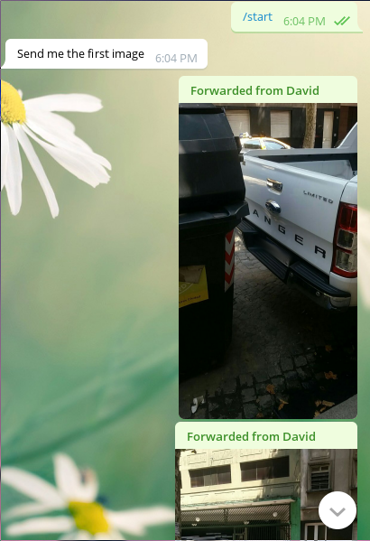
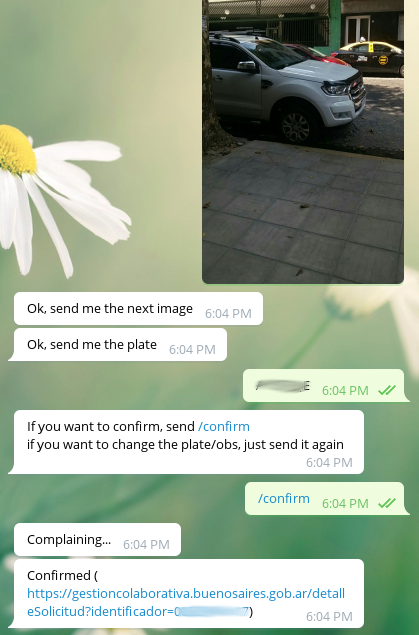
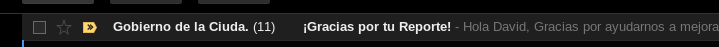

## Notes

* You need to host your own bot
* The link generated will only display 1 of the pictures. This is a 
  front-end bug; both images are pushed (and it should be possible to
  push more than 2..)
* if the images have no EXIF, the current time will be set in the request.
  **Check your server's timezone**

## Dependencies

* BeautifulSoup
* xmltodict
* exifread
* requests

## Features

* exif parsing
  * auto rotation
  * get time
* Reduce image quality on upload
* Generate link to check report status

## Usage
Talk to your bot.

* /start
* (image 1)
* (image 2)
* plate
* /confirm

## Configuration

### lib/data.json

Copy `lib/data.json.example` and set the corresponding values.

### telegram.json
Copy `telegram.json.example` and set the authorized users' ids and 
your bot's token.

## Things to fix:

* Images are downloaded, written to file and read from the file.
